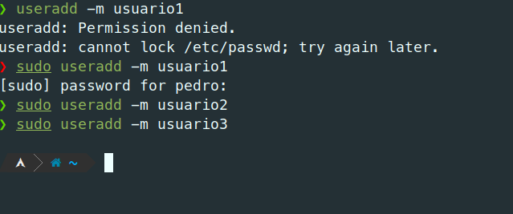
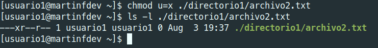
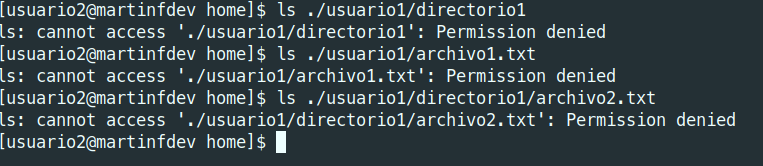

# Actividad 3

## Detalles

### Objetivo: Familiarizar a los estudiantes con la administración de usuarios, grupos y permisos en un sistema operativo Linux.

### Requisitos previos: Tener instalado un sistema Linux y acceso al terminal.

### Envio: Enviar Link al folder actividad3 de su repositorio de GitHub

## Instrucciones

Crear un md file y resolver cada uno de los items solicitados a continución. Debe de colocar el comando utilizado asi como el resultado si este fuera necesario. 

### Parte 1: Gestión de Usuarios
1. Creación de Usuarios: Crea tres usuarios llamados `usuario1`, `usuario2` y `usuario3`.
    ```bash
    sudo useradd usuario1
    sudo useradd usuario2
    sudo useradd usuario3
    ```


Directorios de los usuarios creados:


2. Asignación de Contraseñas: Establece una nueva contraseñas para cada usuario creado.
    ```bash
    sudo passwd usuario1
    sudo passwd usuario2
    sudo passwd usuario3
    ```


3. Información de Usuarios: Muestra la información de `usuario1` usando el comando `id`.
    ```bash
    id usuario1
    ```


4. Eliminación de Usuarios: Elimina `usuario3`, pero conserva su directorio principal.
    ```bash
    sudo userdel usuario3
    ```


### Parte 2: Gestión de Grupos
1. Creación de Grupos: Crea dos grupos llamados `grupo1` y `grupo2`.
    ```bash
    sudo groupadd grupo1
    sudo groupadd grupo2
    ```


2. Agregar Usuarios a Grupos: Agrega `usuario1` a `grupo1` y `usuario2` a `grupo2`.
    ```bash
    sudo usermod -aG grupo1 usuario1
    sudo usermod -aG grupo2 usuario2

3. Verificar Membresía: Verifica que los usuarios han sido agregados a los grupos utilizando el comando `groups`.
    ```bash
    groups usuario1
    groups usuario2
    ```


4. Eliminar Grupo: Elimina `grupo2`.
    ```bash
    sudo groupdel grupo2
    ```

### Parte 3: Gestión de Permisos
1. Creación de Archivos y Directorios:

- Como `usuario1`, crea un archivo llamado `archivo1.txt` en su directorio principal y escribe algo en él.

Cambiado a usuario1:
```bash
    su usuario1
```


Creacion de archivo1.txt:
```bash
    touch archivo1.txt
```


Escribir en archivo1.txt:


- Crea un directorio llamado `directorio1` y dentro de ese directorio, un archivo llamado `archivo2.txt`.
```bash
    mkdir directorio1
    touch directorio1/archivo2.txt
```


2. Verificar Permisos: Verifica los permisos del archivo y directorio usando el comando `ls -l` y `ls -ld` respectivamente.
    ```bash
    ls -l archivo1.txt
    ls -l directorio1/archivo2.txt
    ls -ld directorio1
    ```


3. Modificar Permisos usando `chmod` con Modo Numérico: Cambia los permisos del `archivo1.txt` para que sólo `usuario1` pueda leer y escribir (permisos `rw-`), el grupo pueda leer (permisos `r--`) y nadie más pueda hacer nada.

```bash
    chmod 640 archivo1.txt
```


4. Modificar Permisos usando `chmod` con Modo Simbólico: Agrega permiso de ejecución al propietario del `archivo2.txt`.


5. Cambiar el Grupo Propietario: Cambia el grupo propietario de `archivo2.txt` a `grupo1`.
```bash
    chgrp grupo1 directorio1/archivo2.txt
    ls -l directorio1/archivo2.txt
```


6. Configurar Permisos de Directorio: Cambia los permisos del `directorio1` para que sólo el propietario pueda entrar (permisos `rwx`), el grupo pueda listar contenidos pero no entrar (permisos `r--`), y otros no puedan hacer nada.
```bash
    chmod 750 directorio1
    ls -l
```


7. Comprobación de Acceso: Intenta acceder al `archivo1.txt` y `directorio1/archivo2.txt` como `usuario2`. Nota cómo el permiso de directorio afecta el acceso a los archivos dentro de él.



8. Verificación Final: Verifica los permisos y propietario de los archivos y directorio nuevamente con `ls -l` y `ls -ld`.
```bash
    ls -lR
```


### Reflexión:


- ¿Por qué es importante gestionar correctamente los usuarios y permisos en un sistema operativo?

Es importante gestionar correctamente los usuarios y permisos en un sistema operativo para garantizar la seguridad y privacidad de la información almacenada en el sistema. Al asignar permisos adecuados a los usuarios y grupos, se puede controlar quién puede acceder, leer, escribir o ejecutar archivos y directorios, evitando así accesos no autorizados y posibles daños a los datos. Además, la gestión de usuarios y permisos permite organizar y controlar el acceso a los recursos del sistema, facilitando la administración y mantenimiento del mismo.

- ¿Qué otros comandos o técnicas conocen para gestionar permisos en Linux?

Además de los comandos `chmod` y `chgrp`, existen otros comandos y técnicas para gestionar permisos en Linux, como:

- `chown`: Permite cambiar el propietario de un archivo o directorio.
- `umask`: Establece los permisos predeterminados para los archivos y directorios creados por un usuario.
- `setfacl`: Permite establecer permisos de acceso avanzados, como permisos de acceso a nivel de usuario y permisos heredados.
- `getfacl`: Muestra los permisos de acceso avanzados de un archivo o directorio.
- `su` y `sudo`: Permiten cambiar de usuario o ejecutar comandos con privilegios de superusuario.
- `visudo`: Permite editar el archivo de configuración de sudoers de forma segura.
- `passwd`: Permite cambiar la contraseña de un usuario.
- `usermod`: Permite modificar los atributos de un usuario, como el grupo principal, grupos secundarios, directorio principal, etc.
- `groupmod`: Permite modificar los atributos de un grupo, como el nombre o el GID.
- `userdel`: Permite eliminar un usuario.
- `groupdel`: Permite eliminar un grupo.
