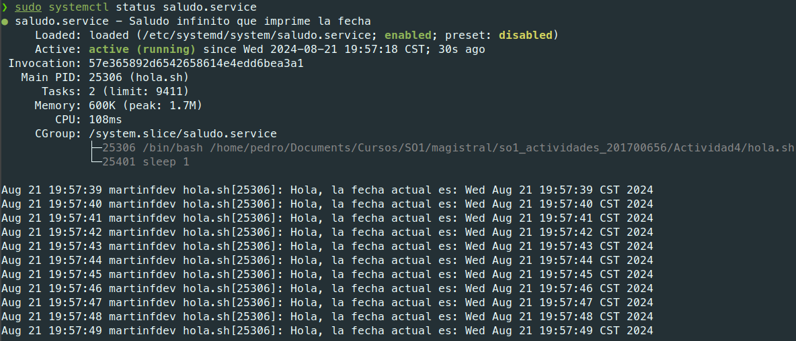
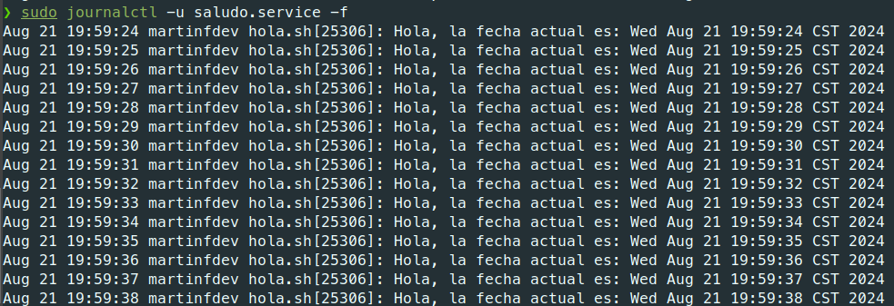

# Servicio de Saludo Infinito

Este servicio ejecuta un script que imprime un saludo y la fecha actual de manera infinita con una pausa de un segundo entre cada impresión.

## Instalación

1. Crear el script `hola.sh`
  
2. Darle permisos de ejecucion al script
```
chmod +x hola.sh
```

3. Crear el archivo de la unidad systemd en /etc/systemd/system/saludo.service con el siguiente contenido:

```
[Unit]
Description=Saludo infinito que imprime la fecha
After=network.target

[Service]
ExecStart=/ruta/al/script/hola.sh
Restart=always
User=nombredelusuario
Group=nombredelgrupo

[Install]
WantedBy=multi-user.target
```

4. Recargar el daemon de systemd
```
sudo systemctl daemon-reload
```

5. Iniciar el servicio
```
sudo systemctl start saludo.service
```

## Verificación

 - Verificar el estado del servicio
```
sudo systemctl status saludo.service
```



- Ver los logs del servicio
```
sudo journalctl -u saludo.service -f
```


